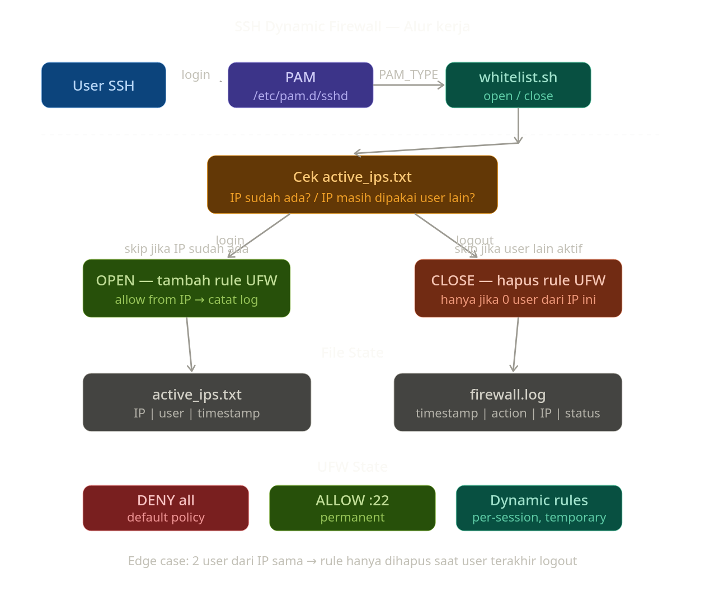

# Cetak Biru: SSH Dynamic Firewall

---

Struktur File & Direktori

/etc/ssh-firewall/
├── whitelist.sh ← script utama (buka/tutup firewall)
├── active_ips.txt ← daftar IP yang sedang aktif + siapa usernya
└── firewall.log ← log semua aktivitas

/etc/pam.d/sshd ← tambahkan trigger ke sini (sudah ada, tinggal edit)
Owner semua file = senvada

Logic Alur Kerja

Saat User Login SSH

1. User masukkan password SSH
2. PAM validasi password → BERHASIL
3. PAM panggil whitelist.sh dengan parameter "OPEN"
4. Script ambil IP user dari environment variable $SSH_CLIENT
5. Script cek: apakah IP ini sudah ada di active_ips.txt?
├── Sudah ada → skip, tidak perlu tambah rule lagi
└── Belum ada → tambah rule UFW "allow from IP_INI"
6. Catat di active_ips.txt → "IP | USERNAME | TIMESTAMP"
7. Catat di firewall.log

Saat User Logout SSH

1. User disconnect / logout
2. PAM deteksi session ditutup
3. PAM panggil whitelist.sh dengan parameter "CLOSE"
4. Script ambil IP user
5. Script cek active_ips.txt:
└── Apakah IP ini masih dipakai user LAIN yang masih login?
├── YA (misal 2 user dari IP yang sama) → jangan hapus rule nya dulu
└── TIDAK (sudah tidak ada user dari IP ini) → hapus rule UFW
6. Update active_ips.txt → hapus entry user ini
7. Catat di firewall.log

Kenapa Perlu Cek "IP dipakai user lain"?

Kasus edge case:
User A login dari IP 114.x.x.x → rule dibuat
User B login dari IP 114.x.x.x → IP sama (misal satu kantor)
User A logout → jangan hapus rule! User B masih aktif
User B logout → baru hapus rule
Makanya active_ips.txt menyimpan per-user, bukan per-IP.

Struktur active_ips.txt
114.x.x.x | userA | 2024-01-15 09:00:00
114.x.x.x | userB | 2024-01-15 09:05:00
180.x.x.x | userC | 2024-01-15 10:00:00

Struktur firewall.log
[2024-01-15 09:00:00] OPEN | userA | 114.x.x.x | rule ADDED
[2024-01-15 09:05:00] OPEN | userB | 114.x.x.x | IP already allowed, skipped
[2024-01-15 10:00:00] OPEN | userC | 180.x.x.x | rule ADDED
[2024-01-15 11:00:00] CLOSE | userA | 114.x.x.x | user B still active, skipped
[2024-01-15 12:00:00] CLOSE | userB | 114.x.x.x | rule REMOVED

Firewall Default State

UFW Rules (permanent):
├── DENY semua incoming ← default
├── ALLOW port 22 dari mana saja ← SSH tetap terbuka
└── [dynamic rules dari script] ← temporary, berdasarkan siapa yang login

Komponen yang Terlibat

PAM (/etc/pam.d/sshd)
└── trigger whitelist.sh
├── baca $SSH_CLIENT (dapat IP user)
├── baca $PAM_USER (dapat username)
├── baca $PAM_TYPE (open_session / close_session)
├── tulis/hapus active_ips.txt
├── jalankan UFW command
└── tulis firewall.log

Ownership & Permission

senvada → owner semua file di /etc/ssh-firewall/
whitelist.sh → executable, hanya bisa dijalankan root/senvada
active_ips.txt → writable oleh senvada
firewall.log → writable oleh sshguard
Script perlu sudo UFW tanpa password (sudoers khusus hanya untuk UFW command). 
